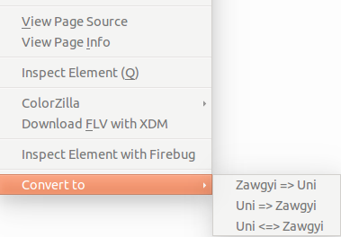

# magicConverter

A myanmar text converter addon to convert between zawgyi and unicode for firefox.
Inspired <a href="https://github.com/swanhtet1992/MagicButton">Magic Button Chrome Plugin</a> by <a href="https://github.com/swanhtet1992">Swan Htet Aung</a>.

###Converter

Magic Converter also use <a href="https://github.com/ngwestar/parabaik">Parabaik</a> for conversion and use
regular expression to check Myanmar text and unicode from <a href="https://github.com/saturngod/Tagu-firefox">Tagu</a>.

###Contribution

Feel free to use, contribute and pull requests also are welcome

###Installation

Make sure you've installed firefox addon sdk.

	$ git clone https://github.com/Arkar-Aung/magicConverter.git
    $ cd magicConverter
    $ cfx run
   
You can directly install it from mozilla addon site : <a href="https://addons.mozilla.org/en-US/firefox/addon/magicconverter/">Magic Converter</a>

###Usage

Press right click on the text which you want to convert. It works on either input or text on webpage.

